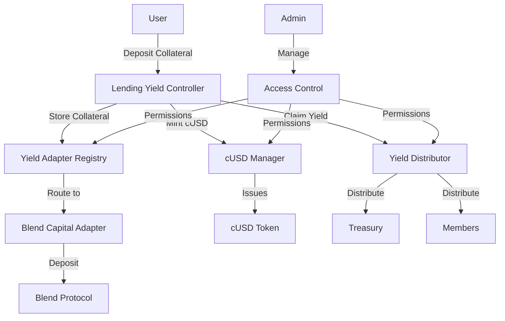

# Coopstable - Decentralized Cooperative Stablecoin Protocol

Coopstable is a decentralized cooperative stablecoin protocol built on the Stellar network using Soroban smart contracts. The system implements a novel "lossless donation" model where users mint cUSD stablecoins by depositing collateral into yield-generating DeFi protocols, with the generated yield distributed to cooperative members and projects while users retain their principal.

## Table of Contents

- [Overview](#overview)
- [Architecture](#architecture)
- [Prerequisites](#prerequisites)
- [Project Structure](#project-structure)
- [Getting Started](#getting-started)
- [Smart Contracts](#smart-contracts)
- [Deployment](#deployment)
- [Common Operations](#common-operations)
- [Testing](#testing)
- [TypeScript Bindings](#typescript-bindings)
- [System Configuration](#system-configuration)
- [Troubleshooting](#troubleshooting)
- [Protocol Economics](#protocol-economics)
- [Contributing](#contributing)
- [License](#license)

## Overview

The Coopstable system consists of several interconnected smart contracts that work together to:

1. **Manage collateralized stablecoin minting and burning** through the cUSD Manager
2. **Generate yield through extensible protocol adapters** (currently Blend Capital)
3. **Distribute yield to cooperative members and treasury** through time-based epochs
4. **Provide a registry system** for managing multiple yield protocols
5. **Implement role-based access control** across all system components

### Key Features

- **Collateral-backed stablecoin**: Mint cUSD 1:1 by depositing USDC and other supported assets
- **Automated yield generation**: Earn yield from DeFi protocols (currently Blend Capital)
- **Cooperative distribution**: Yield distributed equally among members after treasury share
- **Lossless donations**: Users retain their principal while supporting public goods
- **Modular architecture**: Extensible adapter system for multiple yield protocols
- **Time-based epochs**: Configurable distribution periods prevent gaming
- **Role-based access control**: Owner/Admin permission hierarchy
- **Emissions rewards**: Claim protocol token emissions (e.g., BLND) in addition to yield

## Architecture



## Prerequisites

- **Rust** 1.70 or later
- **Stellar CLI** 20.0.0 or later
- **Node.js** (for TypeScript bindings)
- **Make** (for build automation)
- **Soroban contracts** capability (included in Stellar CLI)
- **Git** for version control

### Installation

1. Install Rust:
```bash
curl --proto '=https' --tlsv1.2 -sSf https://sh.rustup.rs | sh
```

2. Install Stellar CLI:
```bash
cargo install --locked stellar-cli
```

3. Add WebAssembly target:
```bash
rustup target add wasm32v1-none
```

## Project Structure

```
├── contracts/                    # Core smart contracts
│   ├── cusd_manager/             # cUSD token management and minting
│   ├── yield_adapter_registry/   # Registry for yield protocol adapters
│   ├── yield_distributor/        # Yield distribution with epochs
│   └── lending_yield_controller/ # Main system orchestrator
├── packages/                     # Shared libraries and adapters
│   ├── yield_adapter/            # Common adapter interfaces
│   └── blend_capital_adapter/    # Blend Capital protocol integration
├── target/                       # Build artifacts
│   └── wasm32v1-none/release/    # Compiled WASM contracts
├── ts/                          # TypeScript bindings (generated)
├── Cargo.toml                    # Workspace configuration
├── Makefile                      # Comprehensive build and deployment automation
└── README.md
```

## Getting Started

### 1. Clone the Repository

```bash
git clone https://github.com/BreadchainCoop/Coop-Stable-Contracts
cd coopstable-contracts
```

### 2. Build the Project

```bash
# Build all contracts
make build

# Build and run tests
make test

# Format code
make fmt

# Clean build artifacts
make clean
```

### 3. View Available Commands

```bash
# Show all available make targets
make help
```

The Makefile provides comprehensive automation for building, testing, deploying, and managing the Coopstable protocol.

## Smart Contracts

### Core Contracts

| Contract | Description | Key Functions |
|----------|-------------|---------------|
| **cUSD Manager** | Central authority for cUSD token lifecycle | `issue_cusd()`, `burn_cusd()`, `cusd_total_supply()` |
| **Lending Yield Controller** | Main system orchestrator and user interface | `deposit_collateral()`, `withdraw_collateral()`, `claim_yield()` |
| **Yield Distributor** | Manages yield distribution with epochs | `distribute_yield()`, `add_member()`, `is_distribution_available()` |
| **Yield Adapter Registry** | Registry for managing yield protocol adapters | `register_adapter()`, `get_adapter()`, `is_supported_asset()` |

### Adapter Packages

| Package | Description | Key Functions |
|---------|-------------|---------------|
| **yield_adapter** | Common interfaces for all yield adapters | `LendingAdapter` trait, events, types |
| **blend_capital_adapter** | Blend Capital protocol integration | `deposit()`, `withdraw()`, `get_yield()`, `claim_emissions()` |

### System Flow

1. **User deposits collateral** → Lending Yield Controller
2. **Controller routes to adapter** → Blend Capital Adapter
3. **Adapter deposits to protocol** → Blend Capital Pool
4. **Controller mints cUSD** → cUSD Manager
5. **Yield accumulates** → Claimed periodically
6. **Yield distributed** → Treasury and Members via Yield Distributor

## Deployment

### Prerequisites

1. **Create accounts** for different roles:
```bash
stellar keys generate owner
stellar keys generate admin
stellar keys generate treasury
stellar keys generate member_1
stellar keys generate member_2
stellar keys generate member_3
```

2. **Fund accounts** with XLM:
```bash
stellar keys fund $(stellar keys public-key owner)
stellar keys fund $(stellar keys public-key admin)
stellar keys fund $(stellar keys public-key treasury)
```

### Automated Deployment

The Makefile provides comprehensive deployment automation:

```bash
# Build and deploy entire protocol
make quick-deploy

# Deploy protocol with dependency management
make deploy-protocol

# Clean redeploy entire protocol
make redeploy-protocol

# Deploy specific components
make deploy-cusd-manager-full
make deploy-controller-full
make deploy-blend-adapter-full
```

### Manual Deployment Steps

1. **Build contracts**:
```bash
make build
```

2. **Deploy contracts in dependency order**:
```bash
# Deploy core contracts
make deploy-core

# Deploy adapters
make deploy-adapters

# Configure all contracts
make configure-all
```

3. **Add members to yield distribution**:
```bash
make add-all-members
```

### Configuration

After deployment, the system is automatically configured with:
- cUSD Manager set as token issuer
- Yield Controller configured in cUSD Manager
- Yield Controller set in Yield Distributor
- Blend Capital Adapter registered for USDC
- Treasury and members configured

### Testnet Deployment

Set the network variable:
```bash
NETWORK=testnet make deploy-protocol
```

### Deployment Verification

```bash
# Check deployment status
make verify-deployment

# View all deployed addresses
make show-addresses

# Check protocol configuration
make check-config
```

## Common Operations

### Protocol Testing

```bash
# Test complete workflow
make test-full-cycle

# Test individual operations
make test-deposit
make test-claim-yield
make test-withdraw

# Read current yield
make test-read-yield

# Check balances
make get-balances
```

### Deposit Collateral and Mint cUSD

```bash
# Test deposit (500 USDC)
TEST_AMOUNT=5000000000 make test-deposit

# Or manually
stellar contract invoke \
  --source admin \
  --network testnet \
  --id <LENDING_YIELD_CONTROLLER_ADDRESS> \
  -- \
  deposit_collateral \
  --protocol BC_LA \
  --user $(stellar keys public-key admin) \
  --asset <USDC_ADDRESS> \
  --amount 5000000000
```

### Claim Yield and Distribute

```bash
# Claim accumulated yield
make test-claim-yield

# Check distribution status
make check-distribution-status

# View distribution history
make distribution-history
```

### Member Management

```bash
# Add a member
make add-member MEMBER=$(stellar keys public-key member_1)

# List all members
make list-members

# Check next distribution time
make next-distribution
```

### Withdraw Collateral

```bash
# Withdraw specific amount
TEST_AMOUNT=1000000000 make test-withdraw

# Withdraw all cUSD balance
make burn-cusd ACC=admin
```

## Testing

### Unit Tests

```bash
# Run all tests
make test

# Run specific contract tests
cd contracts/cusd_manager
make test

# Run specific package tests
cd packages/blend_capital_adapter
make test
```

## TypeScript Bindings

Generate TypeScript bindings for frontend integration:

```bash
# Generate all bindings
make bindings

# Or generate manually for specific contracts
stellar contract bindings typescript \
  --wasm target/wasm32v1-none/release/cusd_manager.wasm \
  --output-dir ts/cusd_manager \
  --overwrite
```

Bindings will be available in the `./ts/` directory with one folder per contract.

## System Configuration

### Default Configuration

- **Treasury Share**: 10% (1000 basis points)
- **Distribution Period**: 24 hours (86400 seconds)
- **Supported Assets**: USDC
- **Yield Protocol**: Blend Capital
- **Network**: Testnet (configurable)

### Environment Variables

```bash
# Override default values
NETWORK=testnet make deploy-protocol
TREASURY_SHARE_BPS=500 make deploy-protocol
DISTRIBUTION_PERIOD=3600 make deploy-protocol
```

## Troubleshooting

### Common Issues

1. **Insufficient Balance**: Ensure all accounts are funded with XLM
2. **Authorization Errors**: Check that proper roles are assigned
3. **Asset Support**: Verify assets are registered in the adapter registry
4. **Distribution Not Available**: Check time since last distribution
5. **Build Errors**: Ensure `wasm32v1-none` target is installed

### Stellar CLI Debugging

- Use `stellar contract events` to view transaction events
- Check contract state with `stellar contract read`
- Monitor network with Stellar Laboratory
- View transaction details with `stellar tx show`

## Protocol Economics

### Yield Distribution Model

- **Treasury receives**: 10% of yield (configurable)
- **Members receive**: 90% of yield distributed equally
- **Distribution frequency**: Every 24 hours (configurable)
- **Minimum distribution**: Only when yield is available

### Supported Assets

- **USDC**: Primary collateral asset
- **Future assets**: Expandable through adapter registry

### Protocol Integration

- **Blend Capital**: Current yield source
- **Emissions**: BLND token rewards claimed separately
- **Future protocols**: Extensible adapter architecture

## Contributing

1. Fork the repository
2. Create a feature branch (`git checkout -b feature/amazing-feature`)
3. Commit your changes (`git commit -m 'Add some amazing feature'`)
4. Push to the branch (`git push origin feature/amazing-feature`)
5. Open a Pull Request

### Development Guidelines

- Follow Rust and Soroban best practices
- Write comprehensive tests for new features
- Update documentation for breaking changes
- Use meaningful commit messages

## License

This project is licensed under the MIT License - see the [LICENSE](LICENSE) file for details.

## Acknowledgments

- [Stellar Development Foundation](https://stellar.org/) for Soroban smart contract platform
- [Blend Capital](https://www.blend.capital/) for yield protocol integration
- The Breadchain Cooperative community for cooperative stablecoin vision
- Bread Token project for inspiration on yield-bearing stablecoins