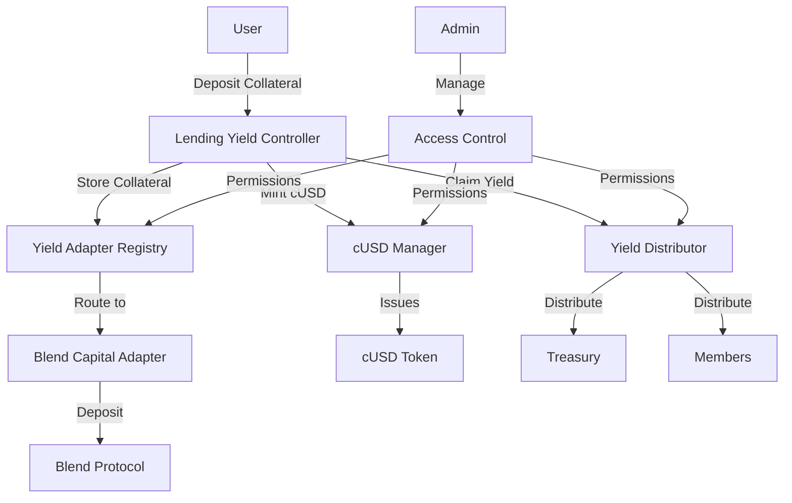

# Coopstable - Decentralized Stable Coin System

Coopstable is a decentralized stable coin (cUSD) system built on the Stellar network. The system enables users to mint stable coins by providing collateral to yield-generating protocols, with yield being distributed to members of the cooperative.

## Table of Contents

- [Overview](#overview)
- [Architecture](#architecture)
- [Prerequisites](#prerequisites)
- [Project Structure](#project-structure)
- [Getting Started](#getting-started)
- [Smart Contracts](#smart-contracts)
- [Deployment](#deployment)
- [Testing](#testing)
- [Contributing](#contributing)
- [License](#license)

## Overview

The Coopstable system consists of several interconnected smart contracts that work together to:

1. **Manage collateralized stable coin minting and burning**
2. **Generate yield through yield adapters** (e.g., Blend Capital integration)
3. **Distribute yield to cooperative members**

### Key Features

- **Collateral-backed stable coin**: Mint cUSD by depositing supported assets
- **Yield generation**: Earn yield from DeFi protocols automatically
- **Cooperative distribution**: Yield is distributed among members
- **Modular design**: Support for multiple yield protocols through adapters
- **Role-based access control**: Secure permission management system

## Architecture



## Prerequisites

- **Rust** 1.70 or later
- **Stellar CLI** 20.0.0 or later
- **Node.js** (for TypeScript bindings)
- **Make** (for build automation)

### Installation

1. Install Rust:
```bash
curl --proto '=https' --tlsv1.2 -sSf https://sh.rustup.rs | sh
```

2. Install Stellar CLI:
```bash
cargo install --locked stellar-cli
```

3. Add WebAssembly target:
```bash
rustup target add wasm32v1-none
```

## Project Structure

```
├── contracts/                    # Core smart contracts
│   ├── cusd_manager/             # cUSD token management
│   ├── yield_adapter_registry/   # Adapter registry
│   ├── yield_distributor/        # Yield distribution
│   └── lending_yield_controller/ # Main controller
├── packages/                     # Shared libraries
│   ├── access_control/           # Permission management
│   ├── yield_adapter/            # Adapter interfaces
│   └── blend_capital_adapter/    # Blend protocol integration
├── deployments/                  # Deployment configurations
│   ├── local.json
│   └── testnet.json
├── Cargo.toml                    # Workspace configuration
├── Makefile                      # Build automation
└── README.md
```

## Getting Started

### 1. Clone the Repository

```bash
git clone https://github.com/BreadchainCoop/Coop-Stable-Contracts
cd Coop-Stable-Contracts
```

### 2. Build the Project

```bash
# Build all contracts
make build

# Or build individual components
cd contracts/cusd_manager
make build
```

### 3. Run Tests

```bash
# Run all tests
make test

# Run specific contract tests
cd contracts/cusd_manager
make test
```

### 4. Format Code

```bash
make fmt
```

## Smart Contracts

### Core Contracts

| Contract | Description | Key Functions |
|----------|-------------|---------------|
| **cUSD Manager** | Manages cUSD token minting/burning | `issue_cusd()`, `burn_cusd()` |
| **Yield Adapter Registry** | Manages yield protocol adapters | `register_adapter()`, `get_adapter()` |
| **Yield Distributor** | Distributes yield to members | `distribute_yield()`, `add_member()` |
| **Lending Yield Controller** | Main system controller | `deposit_collateral()`, `claim_yield()` |

### Packages

| Package | Description |
|---------|-------------|
| **access_control** | Role-based permission system |
| **yield_adapter** | Interfaces for yield adapters |
| **blend_capital_adapter** | Blend Capital integration |

## Deployment

### Prerequisites

1. **Create accounts** for different roles:
```bash
stellar keys generate owner
stellar keys generate admin
stellar keys generate treasury
```

2. **Fund accounts** with XLM:
```bash
stellar keys fund $(stellar keys public-key owner)
```

### Local Deployment

1. **Start local network**:
```bash
stellar network container start local
```

2. **Deploy cUSD asset**:
```bash
stellar contract asset deploy \
  --source owner \
  --asset CUSD:$(stellar keys public-key owner) \
  --network local
```

3. **Deploy contracts** in order:
```bash
# Deploy cUSD Manager
stellar contract deploy \
  --wasm ./target/wasm32v1-none/release/cusd_manager.wasm \
  --source owner \
  --network local \
  --alias cusd_manager \
  -- \
  --cusd_id <SAC_ID> \
  --owner $(stellar keys public-key owner) \
  --admin $(stellar keys public-key admin)

# Deploy Yield Adapter Registry
stellar contract deploy \
  --wasm ./target/wasm32v1-none/release/yield_adapter_registry.wasm \
  --source owner \
  --network local \
  --alias yield_adapter_registry \
  -- \
  --admin $(stellar keys public-key admin)

# Deploy Yield Distributor
stellar contract deploy \
  --wasm ./target/wasm32v1-none/release/yield_distributor.wasm \
  --source owner \
  --network local \
  --alias yield_distributor \
  -- \
  --treasury $(stellar keys public-key treasury) \
  --treasury_share_bps 1000 \
  --yield_controller GAAAAAAAAAAAAAAAAAAAAAAAAAAAAAAAAAAAAAAAAAAAAAAAAAAAAWHF \
  --distribution_period 60 \
  --owner $(stellar keys public-key owner) \
  --admin $(stellar keys public-key admin)

# Deploy Lending Yield Controller
stellar contract deploy \
  --wasm ./target/wasm32v1-none/release/lending_yield_controller.wasm \
  --source owner \
  --network local \
  --alias lending_yield_controller \
  -- \
  --yield_distributor <YIELD_DISTRIBUTOR_ADDRESS> \
  --adapter_registry <YIELD_ADAPTER_REGISTRY_ADDRESS> \
  --cusd_manager <CUSD_MANAGER_ADDRESS> \
  --admin $(stellar keys public-key admin) \
  --owner $(stellar keys public-key owner)

# Deploy Blend Capital Adapter
stellar contract deploy \
  --wasm ./target/wasm32v1-none/release/blend_capital_adapter.wasm \
  --source owner \
  --network local \
  --alias blend_capital_adapter \
  -- \
  --lending_adapter_controller_id <LENDING_YIELD_CONTROLLER_ADDRESS> \
  --lending_pool_id <BLEND_POOL_ID>
```

### Testnet Deployment

Replace `--network local` with `--network testnet` in the above commands.

### Configuration

After deployment, configure the system:

1. **Set yield controller** on distributor:
```bash
stellar contract invoke \
  --source admin \
  --network local \
  --id <YIELD_DISTRIBUTOR_ADDRESS> \
  -- \
  set_yield_controller \
  --caller $(stellar keys public-key admin) \
  --yield_controller <LENDING_YIELD_CONTROLLER_ADDRESS>
```

2. **Register adapter** in registry:
```bash
stellar contract invoke \
  --source admin \
  --network local \
  --id <YIELD_ADAPTER_REGISTRY_ADDRESS> \
  -- \
  register_adapter \
  --caller $(stellar keys public-key admin) \
  --yield_type LEND \
  --protocol BC_LA \
  --adapter_address <BLEND_CAPITAL_ADAPTER_ADDRESS>
```

## Testing

### Unit Tests

```bash
# Run all tests
cargo test

# Run specific package tests
cd packages/access_control
cargo test

# Run with coverage
cargo tarpaulin --out Html
```

## TypeScript Bindings

Generate TypeScript bindings for frontend integration:

```bash
stellar contract bindings typescript \                              
--wasm <path-to-contract-wasm-build> \             
--output-dir ts/<name-of-contract> \
```
Bindings will be available in the `./ts/` directory.

## Common Operations

### Deposit Collateral and Mint cUSD

```bash
# User deposits USDC collateral
stellar contract invoke \
  --source user \
  --network local \
  --id <LENDING_YIELD_CONTROLLER_ADDRESS> \
  -- \
  deposit_collateral \
  --protocol BC_LA \
  --user $(stellar keys public-key user) \
  --asset <USDC_ADDRESS> \
  --amount 1000000000
```

### Claim Yield

```bash
stellar contract invoke \
  --source admin \
  --network local \
  --id <LENDING_YIELD_CONTROLLER_ADDRESS> \
  -- \
  claim_yield
```

### Add Member to Distribution

```bash
stellar contract invoke \
  --source admin \
  --network local \
  --id <YIELD_DISTRIBUTOR_ADDRESS> \
  -- \
  add_member \
  --caller $(stellar keys public-key admin) \
  --member <MEMBER_ADDRESS>
```

## Troubleshooting

### Common Issues

1. **Insufficient Balance**: Ensure all accounts are funded with XLM
2. **Authorization Errors**: Check that proper roles are assigned
3. **Asset Support**: Verify assets are registered in the adapter registry

### Debugging Tools

- Use `stellar contract events` to view transaction events
- Check contract state with `stellar contract read`
- Monitor network with Stellar Laboratory

## Contributing

1. Fork the repository
2. Create a feature branch (`git checkout -b feature/amazing-feature`)
3. Commit your changes (`git commit -m 'Add some amazing feature'`)
4. Push to the branch (`git push origin feature/amazing-feature`)
5. Open a Pull Request

### Development Guidelines

- Follow Rust and Soroban best practices
- Write comprehensive tests for new features
- Update documentation for breaking changes
- Use meaningful commit messages

## License

This project is licensed under the MIT License - see the [LICENSE](LICENSE) file for details.

## Acknowledgments

- [Stellar Development Foundation](https://stellar.org/)
- [Blend Capital](https://www.blend.capital/) for yield protocol integration
- The Breadchain Cooperative community

