# Coopstable Protocol Architecture

## Overview

Coopstable is a decentralized cooperative stablecoin protocol built on the Stellar network using Soroban smart contracts. The protocol implements a **"lossless donation"** model where users mint cUSD stablecoins 1:1 by depositing collateral (USDC) into yield-generating DeFi protocols. The generated yield is distributed to cooperative members and a treasury, while users retain their full principal.

## Core Concepts

### Lossless Donation Model
1. Users deposit USDC collateral
2. Collateral is routed to yield-generating protocols (currently Blend Capital)
3. Users receive cUSD tokens 1:1 for their deposit
4. Yield accumulates from the lending protocol
5. Yield is periodically distributed to cooperative members and treasury
6. Users can redeem cUSD to get back their original USDC principal

### Epoch-Based Distribution
- Yield distribution happens in configurable time periods (epochs)
- Default distribution period: 24 hours
- Each epoch tracks principal, deposits, and withdrawals to accurately calculate yield
- Prevents gaming by ensuring yield is calculated based on epoch-start principal

---

## System Architecture

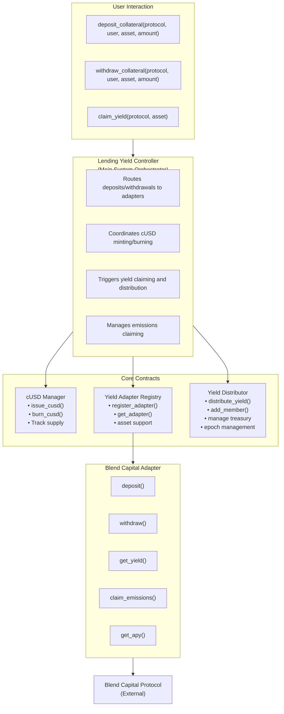

### Component Overview

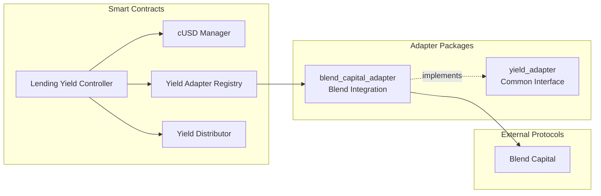

---

## Contract Details

### 1. cUSD Manager (`contracts/cusd_manager/`)

**Purpose:** Central authority for cUSD stablecoin lifecycle management.

**Key Responsibilities:**
- Mint (issue) cUSD tokens when collateral is deposited
- Burn cUSD tokens when collateral is withdrawn
- Track total cUSD supply
- Manage cUSD token contract settings

**Storage Keys:**
| Key | Type | Description |
|-----|------|-------------|
| `Owner` | Address | Contract owner (can set admin) |
| `Admin` | Address | Operational admin |
| `Cusd` | Address | cUSD token contract address |
| `YieldController` | Address | Authorized yield controller |
| `CusdSupply` | i128 | Total cUSD in circulation |

**Key Functions:**
```rust
// Only callable by Yield Controller
fn issue_cusd(to: Address, amount: i128)
fn burn_cusd(from: Address, amount: i128)

// Admin functions
fn set_yield_controller(new_controller: Address)
fn set_cusd_issuer(new_issuer: Address)

// View functions
fn cusd_total_supply() -> i128
fn get_cusd_id() -> Address
```

**Access Control:**
- `issue_cusd`: Yield Controller only
- `burn_cusd`: Any user (burns their own cUSD)
- Admin functions: Admin only
- `set_admin`: Owner only

---

### 2. Lending Yield Controller (`contracts/lending_yield_controller/`)

**Purpose:** Main orchestrator that coordinates all protocol operations.

**Key Responsibilities:**
- Process user deposits and withdrawals
- Route operations to appropriate adapters via registry
- Coordinate cUSD minting/burning with cUSD Manager
- Aggregate and claim yield from all protocols
- Trigger yield distribution
- Manage emissions claiming

**Storage Keys:**
| Key | Type | Description |
|-----|------|-------------|
| `Owner` | Address | Contract owner |
| `Admin` | Address | Operational admin |
| `CUSDManager` | Address | cUSD Manager contract |
| `AdapterRegistry` | Address | Yield Adapter Registry contract |
| `YieldDistributor` | Address | Yield Distributor contract |

**Core Flow - Deposit:**
```
1. User calls deposit_collateral(protocol, user, asset, amount)
2. Controller gets adapter from registry
3. Controller authenticates and calls adapter.deposit()
4. Adapter deposits to Blend Capital pool
5. Controller calls cusd_manager.issue_cusd() to mint cUSD to user
```

**Core Flow - Withdraw:**
```
1. User calls withdraw_collateral(protocol, user, asset, amount)
2. Controller verifies asset is supported
3. Controller authenticates and calls adapter.withdraw()
4. Adapter withdraws from Blend Capital pool
5. Controller calls cusd_manager.burn_cusd() to burn user's cUSD
```

**Core Flow - Claim Yield:**
```
1. Anyone calls claim_yield(protocol, asset)
2. Controller checks if yield > 0 and distribution is available
3. For the specified protocol/asset:
   a. Get yield amount from adapter
   b. Withdraw yield from protocol
   c. Re-deposit yield to protocol (compounding)
   d. Mint cUSD to distributor
   e. Call distributor.distribute_yield()
   f. Update epoch principal for next epoch
```

**Key Functions:**
```rust
fn deposit_collateral(protocol: Symbol, user: Address, asset: Address, amount: i128) -> i128
fn withdraw_collateral(protocol: Symbol, user: Address, asset: Address, amount: i128) -> i128
fn claim_yield(protocol: Symbol, asset: Address) -> i128
fn claim_emissions(protocol: Symbol, asset: Address) -> i128
fn get_yield(protocol: Symbol, asset: Address) -> i128
fn get_emissions(protocol: Symbol, asset: Address) -> i128
fn get_apy(protocol: Symbol, asset: Address) -> u32
```

---

### 3. Yield Adapter Registry (`contracts/yield_adapter_registry/`)

**Purpose:** Registry for managing yield protocol adapters and supported assets.

**Key Responsibilities:**
- Register/unregister yield adapters
- Track which assets are supported by which adapters
- Provide adapter lookup by yield type and protocol
- Enable multi-protocol support

**Storage Pattern:**
- Adapters are registered by `(yield_type, protocol)` tuple
- Assets are registered per adapter
- Supports multiple yield types: `LEND`, `LIQUIDITY`, `Custom`

**Key Functions:**
```rust
// Admin functions
fn register_adapter(yield_type: Symbol, protocol: Symbol, adapter_address: Address)
fn remove_adapter(yield_type: Symbol, protocol: Symbol)
fn add_support_for_asset(yield_type: Symbol, protocol: Symbol, asset_address: Address)
fn remove_support_for_asset(yield_type: Symbol, protocol: Symbol, asset_address: Address)

// View functions
fn get_adapter(yield_type: Symbol, protocol: Symbol) -> Address
fn get_adapters(yield_type: Symbol) -> Vec<Address>
fn get_adapters_with_assets(yield_type: Symbol) -> Vec<(Address, Vec<Address>)>
fn is_supported_asset(yield_type: Symbol, protocol: Symbol, asset_address: Address) -> bool
```

**Protocol Identifiers:**
- Blend Capital Lending Adapter: `BC_LA` (symbol)
- Yield Type for Lending: `LEND` (symbol)

---

### 4. Yield Distributor (`contracts/yield_distributor/`)

**Purpose:** Manages yield distribution to treasury and cooperative members.

**Key Responsibilities:**
- Track cooperative members
- Configure treasury share percentage
- Enforce distribution periods (epochs)
- Distribute yield proportionally to members
- Track distribution history

**Storage Keys:**
| Key | Type | Description |
|-----|------|-------------|
| `Treasury` | Address | Treasury address |
| `YieldController` | Address | Authorized caller |
| `DistributionConfig` | struct | Treasury share BPS, distribution period |
| `Member(Address)` | Member | Member data |
| `Members` | Vec<Address> | All member addresses |
| `Distribution(epoch)` | Distribution | Distribution record per epoch |
| `TotalDistributed` | i128 | Cumulative yield distributed |

**Distribution Structure:**
```rust
struct Distribution {
    distribution_start_timestamp: u64,
    distribution_end_timestamp: u64,
    distribution_total: i128,
    distribution_treasury: i128,
    distribution_member: i128,
    members: Vec<Address>,
    is_processed: bool,
    epoch: u64,
}
```

**Distribution Logic:**
```
1. Treasury receives: (amount * treasury_share_bps) / 10000
2. Members receive: remaining amount / number_of_members
3. If no members: treasury receives 100%
```

**Key Functions:**
```rust
// Yield Controller only
fn distribute_yield(token: Address, amount: i128) -> i128

// Admin functions
fn add_member(member: Address)
fn remove_member(member: Address)
fn set_treasury(treasury: Address)
fn set_treasury_share(share_bps: u32)
fn set_distribution_period(period: u64)

// View functions
fn is_distribution_available() -> bool
fn get_next_distribution_time() -> u64
fn time_before_next_distribution() -> u64
fn get_current_epoch() -> u64
fn get_distribution_info() -> Distribution
fn get_distribution_history() -> Vec<Distribution>
```

**Default Configuration:**
- Treasury Share: 10% (1000 BPS)
- Distribution Period: 24 hours (86400 seconds)

---

### 5. Blend Capital Adapter (`packages/blend_capital_adapter/`)

**Purpose:** Integration adapter for Blend Capital lending protocol.

**Key Responsibilities:**
- Deposit collateral to Blend Capital pools
- Withdraw collateral from Blend Capital pools
- Calculate and claim yield
- Claim BLND token emissions
- Calculate APY
- Track epoch principal for accurate yield calculation

**Yield Calculation:**
```rust
// Yield = Current Balance - Effective Principal
// Effective Principal = epoch_principal + deposits_in_epoch - withdrawals
fn read_yield(user: Address, asset: Address) -> i128 {
    let current_value = get_balance(user, asset);
    let effective_principal = epoch_data.principal
                            + epoch_data.deposits_in_epoch
                            - epoch_data.withdrawals;

    if current_value <= effective_principal { return 0; }
    current_value - effective_principal
}
```

**Epoch Principal Tracking:**
```rust
struct AssetEpochPrincipal {
    epoch: u64,           // Current epoch number
    principal: i128,      // Principal at epoch start
    withdrawals: i128,    // Withdrawals during epoch
    deposits_in_epoch: i128,  // New deposits during epoch
    last_updated: u64,    // Timestamp of last update
}
```

**APY Calculation:**
The adapter calculates APY by:
1. Getting reserve data from Blend pool
2. Calculating utilization ratio
3. Computing borrow rate based on interest rate curve
4. Deriving supply rate from borrow rate and utilization
5. Converting annual rate to APY with compounding adjustment

**Key Functions (LendingAdapter trait):**
```rust
fn deposit(user: Address, asset: Address, amount: i128) -> i128
fn withdraw(user: Address, asset: Address, amount: i128) -> i128
fn get_yield(asset: Address) -> i128
fn claim_yield(asset: Address, yield_amount: i128) -> i128
fn claim_emissions(to: Address, asset: Address) -> i128
fn get_emissions(asset: Address) -> i128
fn get_apy(asset: Address) -> u32
fn get_balance(user: Address, asset: Address) -> i128
fn get_total_deposited(asset: Address) -> i128
fn protocol_token() -> Address  // Returns BLND token address
fn update_epoch_principal(asset: Address, epoch: u64, principal: i128)
```

---

### 6. Yield Adapter Package (`packages/yield_adapter/`)

**Purpose:** Common interface definitions for all yield protocol adapters.

**LendingAdapter Trait:**
Defines the standard interface that all lending protocol adapters must implement. This enables:
- Pluggable architecture for multiple protocols
- Consistent API across different DeFi integrations
- Future support for protocols beyond Blend Capital

**Supported Types:**
```rust
enum SupportedAdapter {
    BlendCapital,    // id: "BC_LA"
    Custom(Symbol),  // For future adapters
}

enum SupportedYieldType {
    Lending,         // id: "LEND"
    Liquidity,       // id: "LIQUIDITY"
    Custom(Symbol),  // For future yield types
}
```

---

## Data Flow Diagrams

### Deposit Flow

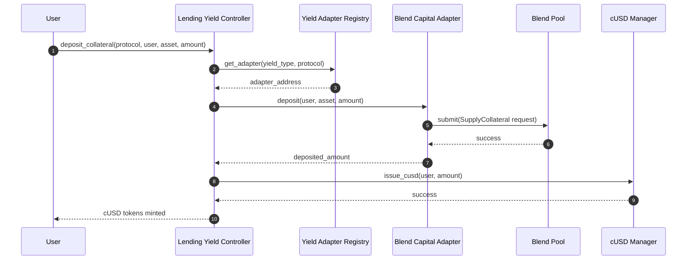

### Withdraw Flow

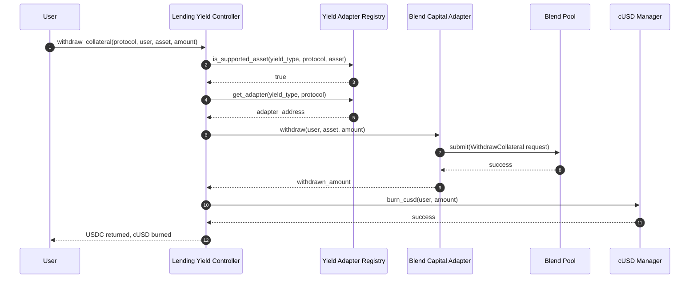

### Yield Claim Flow

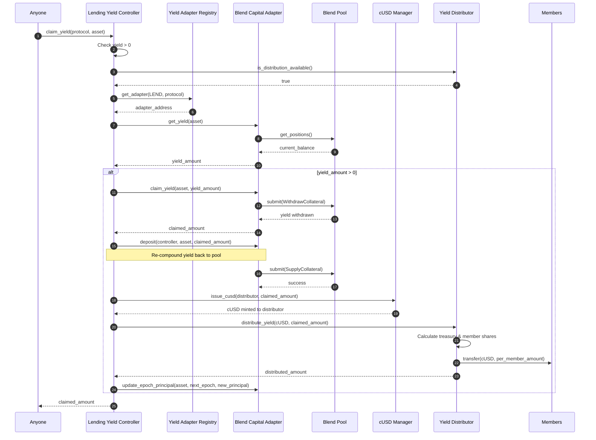

### Yield Distribution Detail

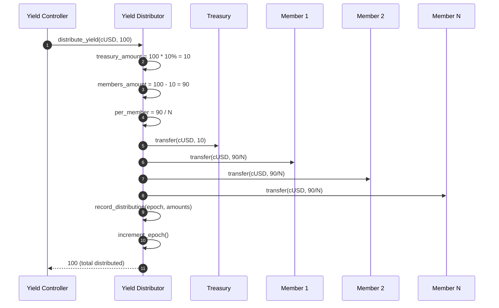

---

## Access Control Model

### Role Hierarchy

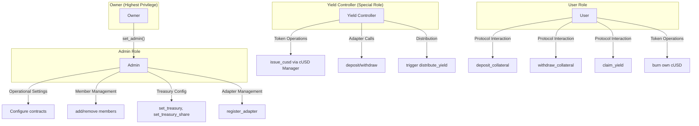

### Contract Access Control

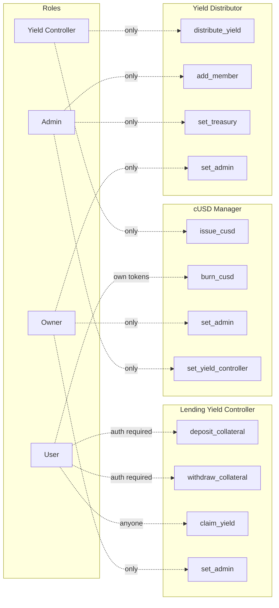

### Permission Matrix

| Function | Owner | Admin | Yield Controller | User |
|----------|-------|-------|------------------|------|
| set_admin | ✓ | | | |
| issue_cusd | | | ✓ | |
| burn_cusd | | | | ✓ |
| deposit_collateral | | | | ✓ |
| withdraw_collateral | | | | ✓ |
| claim_yield | | | | ✓ |
| add_member | | ✓ | | |
| remove_member | | ✓ | | |
| set_treasury | | ✓ | | |
| set_treasury_share | | ✓ | | |
| register_adapter | | ✓ | | |
| distribute_yield | | | ✓ | |

---

## Protocol Economics

### Yield Flow

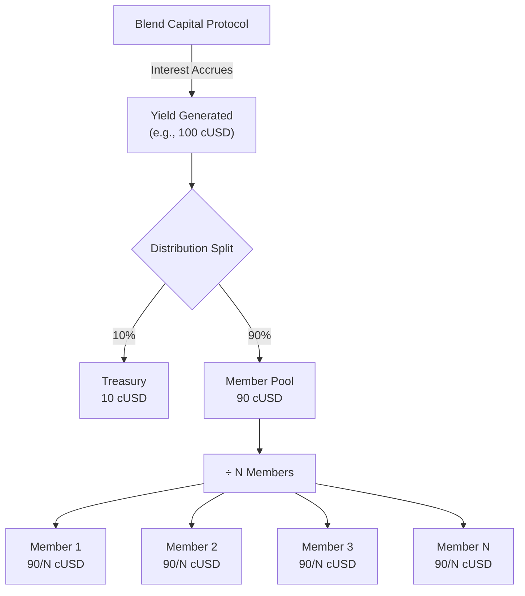

### Complete User Journey

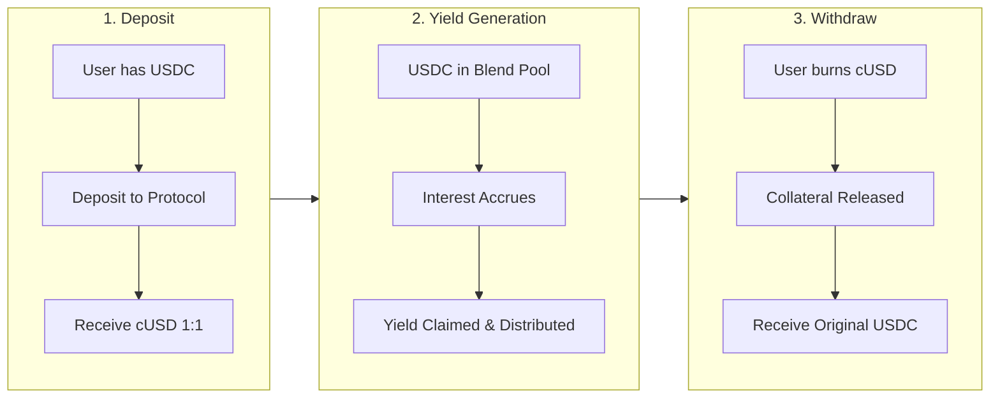

### Epoch Lifecycle

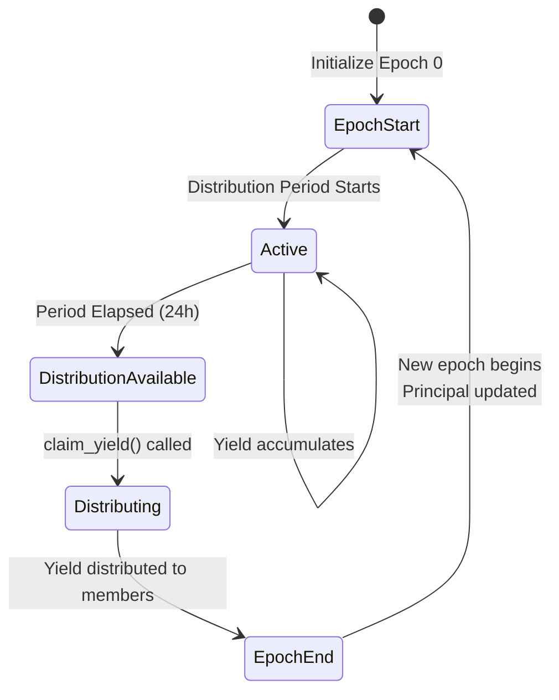

### APY Calculation (Blend Capital)

1. **Utilization** = Total Borrowed / Total Supplied
2. **Borrow Rate** = Piecewise linear based on utilization:
   - 0% to target: `r_base + (util/target) * r_one`
   - Target to 95%: `r_base + r_one + ((util-target)/(95%-target)) * r_two`
   - 95% to 100%: `r_base + r_one + r_two + ((util-95%)/5%) * r_three`
3. **Supply Rate** = Borrow Rate × Utilization × (1 - Backstop Rate)
4. **APY** = APR + Compounding Adjustment

---

## Storage Management

All contracts implement TTL (Time-To-Live) extension patterns:

```rust
// Instance storage (short-term): 7 days
const INSTANCE_BUMP_AMOUNT: u32 = 7 * DAY_IN_LEDGERS;  // 17280 ledgers/day

// Persistent storage (long-term): 90 days
const PERSISTENT_BUMP_AMOUNT: u32 = 90 * DAY_IN_LEDGERS;
```

Storage is extended on each access to prevent data expiration.

---

## Security Considerations

1. **Authorization**: All state-changing functions require appropriate authorization
2. **Input Validation**: Negative amounts are rejected
3. **Reentrancy**: Soroban's execution model prevents reentrancy attacks
4. **Principal Tracking**: Epoch-based principal tracking prevents yield manipulation
5. **Role Separation**: Owner, Admin, and Yield Controller have distinct permissions
6. **Asset Verification**: Only registered assets can be used

---

## Future Extensibility

The modular architecture supports:

1. **Additional Yield Protocols**: New adapters implementing `LendingAdapter` trait
2. **New Yield Types**: Liquidity provision, staking, etc.
3. **Multiple Assets**: Registry can support any Stellar asset
4. **Governance Integration**: Member management can be connected to DAO
5. **Dynamic Treasury Share**: Treasury share can be modified by admin
