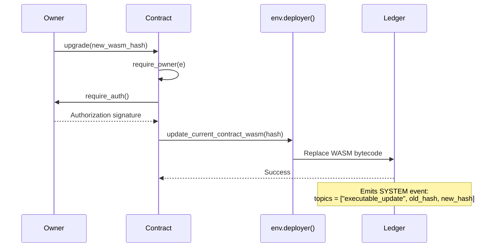

# Contract Upgradeability

This document explains how the Coopstable contracts are upgradeable and provides a step-by-step guide for performing upgrades.

## Overview

All Coopstable smart contracts are upgradeable using Soroban's native upgrade mechanism. This allows the protocol to:

- Fix bugs in deployed contracts
- Add new features without redeploying
- Improve gas efficiency
- Maintain the same contract address and storage

## How Upgradeability Works

### The Upgrade Mechanism

Soroban provides a built-in function for upgrading contracts:

```rust
env.deployer().update_current_contract_wasm(new_wasm_hash: BytesN<32>)
```

This function:
1. Accepts a 32-byte hash of pre-uploaded WASM bytecode
2. Replaces the contract's executable code
3. Preserves the contract's address
4. Preserves all contract storage and data

### Implementation in Coopstable Contracts

Each contract implements an `upgrade` function with owner-only access control:

```rust
fn upgrade(e: &Env, new_wasm_hash: BytesN<32>) {
    require_owner(e);  // Only owner can upgrade
    e.deployer().update_current_contract_wasm(new_wasm_hash);
}
```

### Upgradeable Contracts

| Contract | Location | Upgrade Authority |
|----------|----------|-------------------|
| cUSD Manager | `contracts/cusd_manager/` | Owner |
| Lending Yield Controller | `contracts/lending_yield_controller/` | Owner |
| Yield Adapter Registry | `contracts/yield_adapter_registry/` | Owner |
| Yield Distributor | `contracts/yield_distributor/` | Owner |

## Access Control

Only the **owner** of each contract can perform upgrades. This is enforced by `require_owner(e)` which:

1. Retrieves the owner address from contract storage
2. Calls `owner.require_auth()` to verify cryptographic authorization
3. Only proceeds if authorization is valid



## How to Upgrade a Contract

### Prerequisites

1. **Stellar CLI installed**: Install from [Stellar CLI docs](https://developers.stellar.org/docs/tools/cli)
2. **Owner's secret key**: You must have access to the owner account's secret key
3. **New contract WASM**: The updated contract compiled to `.wasm`
4. **Network access**: Connection to testnet or mainnet

### Step 1: Build the New Contract

First, compile your updated contract:

```bash
# Navigate to the contracts directory
cd coopstable-contracts

# Build all contracts (or specific contract)
stellar contract build

# Or build a specific contract
cd contracts/cusd_manager
cargo build --target wasm32-unknown-unknown --release
```

The compiled WASM will be at:
```
target/wasm32-unknown-unknown/release/<contract_name>.wasm
```

### Step 2: Upload the New WASM to the Network

Upload the new WASM bytecode to get its hash:

```bash
stellar contract upload \
    --source <OWNER_SECRET_KEY> \
    --network testnet \
    --wasm target/wasm32-unknown-unknown/release/cusd_manager.wasm
```

**Output:**
```
<WASM_HASH>
# Example: 7a8b9c0d1e2f3a4b5c6d7e8f9a0b1c2d3e4f5a6b7c8d9e0f1a2b3c4d5e6f7a8b
```

Save this hash - you'll need it for the upgrade.

### Step 3: Invoke the Upgrade Function

Call the `upgrade` function on the deployed contract:

```bash
stellar contract invoke \
    --source <OWNER_SECRET_KEY> \
    --network testnet \
    --id <CONTRACT_ADDRESS> \
    -- \
    upgrade \
    --new_wasm_hash <WASM_HASH>
```

**Example with real values:**

```bash
# Upgrade the cUSD Manager contract
stellar contract invoke \
    --source SBCDEFGHIJKLMNOPQRSTUVWXYZ234567890ABCDEFGHIJKLMNOP \
    --network testnet \
    --id CAAAAAAAAAAAAAAAAAAAAAAAAAAAAAAAAAAAAAAAAAAAAAAAAAAABCDE \
    -- \
    upgrade \
    --new_wasm_hash 7a8b9c0d1e2f3a4b5c6d7e8f9a0b1c2d3e4f5a6b7c8d9e0f1a2b3c4d5e6f7a8b
```

### Step 4: Verify the Upgrade

After upgrading, verify the contract is working correctly:

```bash
# Call any view function to ensure contract responds
stellar contract invoke \
    --source <ANY_SOURCE> \
    --network testnet \
    --id <CONTRACT_ADDRESS> \
    -- \
    <view_function>
```

## Complete Upgrade Tutorial

### Scenario: Upgrading the Lending Yield Controller

Let's walk through upgrading the `lending_yield_controller` contract on testnet.

#### 1. Set Environment Variables

```bash
# Set your owner secret key (keep this secure!)
export OWNER_KEY="SBXXXXXXXXXXXXXXXXXXXXXXXXXXXXXXXXXXXXXXXXXXXXXXXXXXXXXX"

# Set the network
export NETWORK="testnet"

# Set the contract address you want to upgrade
export CONTRACT_ID="CAAAAAAAAAAAAAAAAAAAAAAAAAAAAAAAAAAAAAAAAAAAAAAAAAAABCDE"
```

#### 2. Build the Updated Contract

```bash
cd /path/to/coopstable-contracts

# Build with release optimizations
stellar contract build

# Verify the WASM was created
ls -la target/wasm32-unknown-unknown/release/lending_yield_controller.wasm
```

#### 3. Upload New WASM

```bash
# Upload and capture the hash
WASM_HASH=$(stellar contract upload \
    --source $OWNER_KEY \
    --network $NETWORK \
    --wasm target/wasm32-unknown-unknown/release/lending_yield_controller.wasm)

echo "New WASM hash: $WASM_HASH"
```

#### 4. Execute the Upgrade

```bash
stellar contract invoke \
    --source $OWNER_KEY \
    --network $NETWORK \
    --id $CONTRACT_ID \
    -- \
    upgrade \
    --new_wasm_hash $WASM_HASH
```

#### 5. Test the Upgraded Contract

```bash
# Test a view function
stellar contract invoke \
    --source $OWNER_KEY \
    --network $NETWORK \
    --id $CONTRACT_ID \
    -- \
    get_yield_distributor
```

## Upgrading All Contracts

To upgrade all Coopstable contracts, repeat the process for each:

```bash
#!/bin/bash

# Configuration
OWNER_KEY="your-owner-secret-key"
NETWORK="testnet"

# Contract addresses (replace with actual addresses)
CUSD_MANAGER="CXXXXXXXXXXXXXXX..."
YIELD_CONTROLLER="CXXXXXXXXXXXXXXX..."
ADAPTER_REGISTRY="CXXXXXXXXXXXXXXX..."
YIELD_DISTRIBUTOR="CXXXXXXXXXXXXXXX..."

# Build all contracts
stellar contract build

# Array of contracts to upgrade
declare -A CONTRACTS=(
    ["cusd_manager"]=$CUSD_MANAGER
    ["lending_yield_controller"]=$YIELD_CONTROLLER
    ["yield_adapter_registry"]=$ADAPTER_REGISTRY
    ["yield_distributor"]=$YIELD_DISTRIBUTOR
)

# Upgrade each contract
for contract in "${!CONTRACTS[@]}"; do
    echo "Upgrading $contract..."

    # Upload WASM
    WASM_HASH=$(stellar contract upload \
        --source $OWNER_KEY \
        --network $NETWORK \
        --wasm target/wasm32-unknown-unknown/release/${contract}.wasm)

    echo "  WASM hash: $WASM_HASH"

    # Invoke upgrade
    stellar contract invoke \
        --source $OWNER_KEY \
        --network $NETWORK \
        --id ${CONTRACTS[$contract]} \
        -- \
        upgrade \
        --new_wasm_hash $WASM_HASH

    echo "  $contract upgraded successfully!"
done

echo "All contracts upgraded!"
```

## Best Practices

### Before Upgrading

1. **Test thoroughly**: Deploy and test the new version on testnet first
2. **Review changes**: Ensure storage layout is compatible (see below)
3. **Communicate**: Notify users/integrators about the upcoming upgrade
4. **Backup state**: Document current contract state if needed

### Storage Compatibility

When upgrading, ensure your new contract is compatible with existing storage:

**Safe changes:**
- Adding new storage keys
- Adding new functions
- Modifying function logic (not signatures)

**Potentially breaking changes:**
- Changing storage key types
- Removing required storage keys
- Changing function signatures that integrators depend on

### After Upgrading

1. **Verify functionality**: Test all critical functions
2. **Monitor events**: Watch for the `executable_update` system event
3. **Update documentation**: Document the new version's changes
4. **Notify integrators**: Inform dependent systems of any API changes

## System Events

When an upgrade occurs, Soroban automatically emits a system event:

```
Event Type: SYSTEM
Topics: ["executable_update", <old_wasm_hash>, <new_wasm_hash>]
Data: (empty)
```

You can monitor for these events to track contract upgrades.

## Troubleshooting

### "Unauthorized" Error

**Cause:** The transaction signer is not the contract owner.

**Solution:** Ensure you're using the owner's secret key:
```bash
stellar contract invoke \
    --source <OWNER_SECRET_KEY> \  # Must be owner
    ...
```

### "Invalid WASM Hash" Error

**Cause:** The WASM hash doesn't exist on the network.

**Solution:** Upload the WASM first:
```bash
# Step 1: Upload
stellar contract upload --wasm <path_to_wasm> ...

# Step 2: Then upgrade
stellar contract invoke ... -- upgrade --new_wasm_hash <hash_from_step_1>
```

### Contract Behaves Unexpectedly After Upgrade

**Cause:** Storage incompatibility between versions.

**Solution:**
1. Review storage layout changes
2. If needed, add migration logic in the new contract
3. Consider deploying a fresh contract if migration is complex

## Security Considerations

1. **Protect owner keys**: The owner key can upgrade contracts - keep it secure
2. **Multi-sig recommended**: Consider using a multi-signature setup for production
3. **Time-locks**: Consider adding time-locks for upgrades in production
4. **Audit upgrades**: Have significant upgrades reviewed before deployment

## References

- [Stellar Docs: Upgrading Contracts](https://developers.stellar.org/docs/build/guides/conventions/upgrading-contracts)
- [Stellar CLI Documentation](https://developers.stellar.org/docs/tools/cli)
- [Soroban SDK Documentation](https://docs.rs/soroban-sdk)
